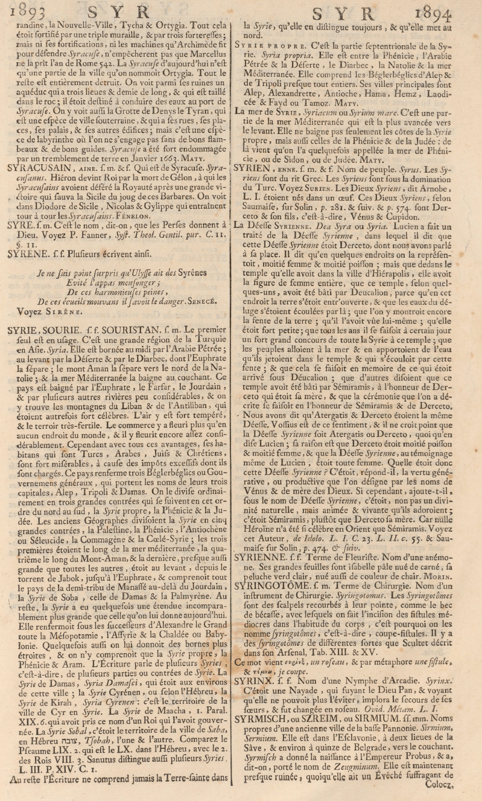

Results
=======

This section presents the evaluation results for each model at each stage of the pipeline,
measured against the gold standard of the *Dictionnaire de Trévoux* (1743).

Experimental Setup
------------------

- **Documents tested**: two pages of the Dictionnaire de Trévoux

  - Page ``Pe`` (entries PÉ, PÉAGE) — 2894 characters

.. figure:: ../Images/page_13.png
   :width: 100%
   :align: center
   :alt: Page Pe — Dictionnaire de Trévoux
   :name: page_13

- Page ``Syr`` (entries SYRACUSE, SYRIE, SYRIEN…) — 8519 characters

- **Gold standard**: manually validated continuous text, UTF-8, no line breaks
- **Post-correction model**: Mistral Large (``mistral-large-latest``, temperature 0)
- **Metrics**: CER and WER after normalisation (see :doc:`3_Metrics`)

Results: Mistral OCR + Mistral Large
--------------------------------------

Page Pe (2894 characters)
^^^^^^^^^^^^^^^^^^^^^^^^^^

.. list-table::
   :header-rows: 1
   :widths: 40 30 30

   * - Stage
     - CER
     - WER
   * - Mistral OCR (raw)
     - 0.0144
     - 0.0649
   * - Mistral OCR + Mistral Large
     - **0.0099**
     - **0.0426**
   * - Gain (Δ)
     - +0.0046
     - +0.0223

Page Syr (8519 characters)
^^^^^^^^^^^^^^^^^^^^^^^^^^^

.. list-table::
   :header-rows: 1
   :widths: 40 30 30

   * - Stage
     - CER
     - WER
   * - Mistral OCR (raw)
     - 0.0339
     - 0.1031
   * - Mistral OCR + Mistral Large
     - **0.0229**
     - **0.0609**
   * - Gain (Δ)
     - +0.0110
     - +0.0422

Results: Qwen2.5-VL 7b
------------------------

Page Pe (2894 characters)
^^^^^^^^^^^^^^^^^^^^^^^^^^

.. list-table::
   :header-rows: 1
   :widths: 40 30 30

   * - Stage
     - CER
     - WER
   * - Qwen2.5-VL 7b (raw)
     - 0.0740
     - 0.1460
   * - Qwen2.5-VL 7b + correction
     - 0.0740
     - 0.1460
   * - Gain (Δ)
     - 0.0000
     - 0.0000

Cross-Model Comparison (Page Pe)
----------------------------------

.. list-table::
   :header-rows: 1
   :widths: 30 20 20 30

   * - Model
     - CER (after correction)
     - WER (after correction)
     - Notes
   * - **Mistral OCR + Mistral Large**
     - **0.0099**
     - **0.0426**
     - Best overall results
   * - Qwen2.5-VL 7b
     - 0.0740
     - 0.1460
     - No gain from correction step

Key Observations
-----------------

**Mistral OCR is the best-performing model**

Across both tested pages, Mistral OCR combined with Mistral Large post-correction
achieves the lowest error rates. On the short page (Pe), the pipeline reaches a CER
of 0.0099 near gold standard quality. On the longer page (Syr), the CER of 0.0229
and WER of 0.0609 remain within the "good" range, suitable for downstream tasks.

**Mistral Large post-correction consistently improves Mistral OCR results**

The correction step reduces WER by 0.022 to 0.042 points depending on page length,
confirming that LLM post-correction is a reliable improvement layer on top of
dedicated OCR output.

**Qwen2.5-VL post-correction had no effect**

The correction step produced identical output for Qwen (ΔCER: 0.000, ΔWER: 0.000).
Inspection of the raw Qwen output reveals two causes:

- Hallucinated fragments in degraded page regions
  (e.g. ``"us de F Provence, paye quoral, po Les Enfantras"``)
- Inclusion of page artefacts (``"Tome V. P E A."``, column separators)

These errors are too severe for the Large correction prompt to fix reliably.
A dedicated pre-processing step to detect and remove hallucinated regions would be
needed before correction can be effective.

**Longer pages are harder to transcribe**

The Syr page (8519 characters) shows higher raw error rates than the Pe page (2894 characters)
for Mistral OCR (WER 0.1031 vs 0.0649), likely due to increased layout complexity,
more proper nouns (geographical names, biblical references), and mixed-language content
(French, Latin, Hebrew, Greek).

**Interpretation against quality thresholds**

.. list-table::
   :header-rows: 1
   :widths: 30 20 20 30

   * - Pipeline
     - CER
     - WER
     - Quality level
   * - Mistral OCR + LLM (Pe)
     - 0.0099
     - 0.0426
     -  Excellent
   * - Mistral OCR + LLM (Syr)
     - 0.0229
     - 0.0609
     -  Good
   * - Mistral OCR raw (Pe)
     - 0.0144
     - 0.0649
     -  Good
   * - Mistral OCR raw (Syr)
     - 0.0339
     - 0.1031
     -  Acceptable
   * - Qwen2.5-VL (Pe)
     - 0.0740
     - 0.1460
     -  Acceptable

.. note::
   However, when it comes to evaluating the models on the other languages, especially Greek and Hebrew, the performance is relatively poor.

.. figure:: /Documentation/Images/Greek-ex.png
   :width: 100%
   :align: center
   :alt: Alternative text for the image
   :name: table_ref

Example lines from selected commentaries on Sophocles’ Ajax: a) Lobeck, b) Schneidewin, c) Campbell, d) Jebb and e) Wecklein, Matteo Romanello, Sven Najem-Meyer, and Bruce Robertson. 2021. Optical Character Recognition of 19th Century Classical Commentaries: the Current State of Affairs.

- For instance:

.. figure:: /Documentation/Images/bsb10234118_0091_4.png
   :width: 100%
   :align: center
   :alt: Alternative text for the image
   :name: table_ref

Mistral OCR:  

- CER : **0.0182**
- WER : **0.0833**

- **GOLD STANDARD:**
tur τὸ ἀθέατον. Sic et Cyrillus Alex. in Exod. L. II. 296.

- **OCR BRUT MISTRAL:**
tur τὸ ἀθέατον. Sie et Cyrillus Alex. in Exod. L. II. 296.

.. figure:: /Documentation/Images/Wecklein1894_0109_13.png
   :width: 100%
   :align: center
   :alt: Alternative text for the image
   :name: table_ref

Mistral OCR: 

- CER : **0.1111**
- WER : **0.6364**

- **GOLD STANDARD:**
(d. i. λειμῶνι, λειμῶνα) ποίαι μήλων. 603 εὐνῶμαι f. εὐνόμᾳ (Triklinios

- **OCR BRUT MISTRAL:**
(b. i. λειμωνι, λειμωνα) ποίαι μήλων. 603 εὐνώμαι †. εὐνόμα (Σriflinios

GLM-OCR (Ziphu AI):
-----------------

When tested on page 1905, GLM-OCR (Ziphu AI) produced the following results:

- CER : **0.1056**
- WER : **0.2639**

It is observed that it usually misses on accents, long s,s→r, ... But most importantly when it applies a layout to follow to transcribe the text inside, it misses sometimes whole words, since the structure of our text isn't the same always.

.. figure:: /Documentation/Images/Voyez_Yez.png
   :width: 100%
   :align: center
   :alt: Alternative text for the image
   :name: table_ref

.. figure:: /Documentation/Images/Voyez_Yez_txt.png
   :width: 100%
   :align: center
   :alt: Alternative text for the image
   :name: table_ref